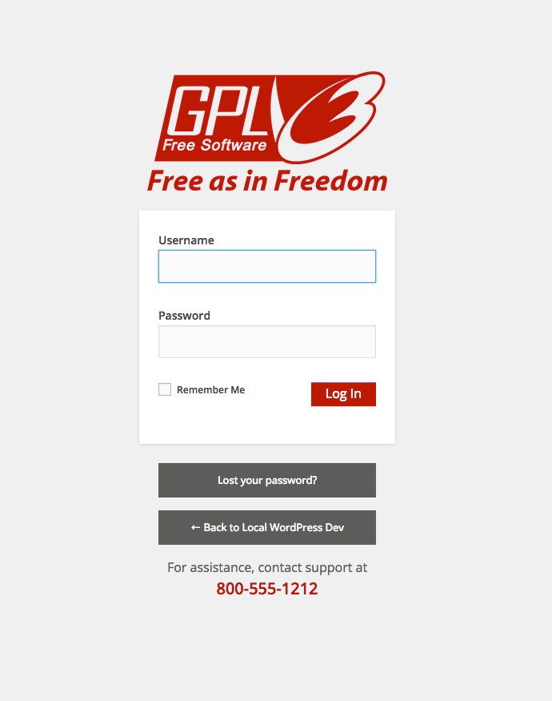

# Simple Login Customizer

A very simple plugin to override the default WordPress login styling. I do not like having it in themes, and do not need any fancy plugins doing all sorts of nonsense.

## What Does It Do

* Gives you all the custom CSS you need to alter the login screen, edit at will
* Changes the login url from default wordpress.org to your site main
* Changes the login url title text to your site name
* Adds a text block in the login footer area for a helpful message

If you wish to remove the footer, you can comment out or delete this line `$this->loader->add_action( 'login_footer', $plugin_public, 'slc_footer' );` found [here](includes/class-simple-login-customizer.php)

To edit the dummy content in the footer, change the text found in the `slc_footer()` function located [over here](public/class-simple-login-customizer-public.php)

## Installation

If you are here, you know how to install a plugin. :)
Either download it, or clone it, either way works!

## Usage

Once installed and activated it will look like the screenshot below. You will want to edit the [CSS](public/css/simple-login-customizer-public.css) files to make it your own. 

## What Does It Look LIke

Well, that will depend on the styling and logo you give it, there is some demo styling already and a generic logo, so when fired up by default it looks like this,

